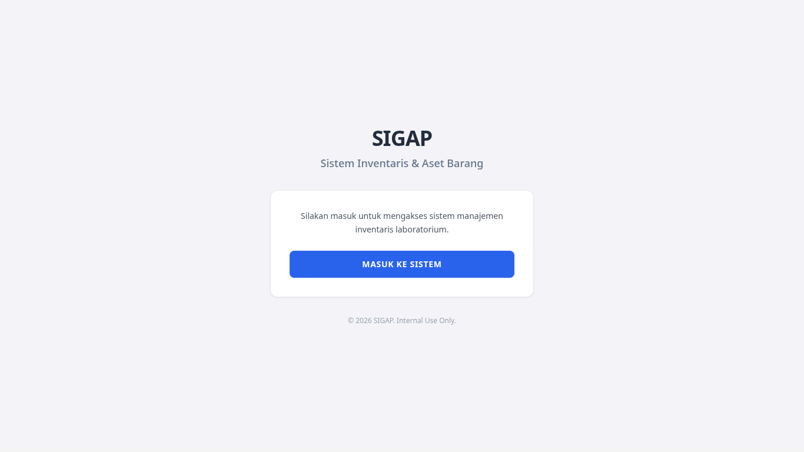
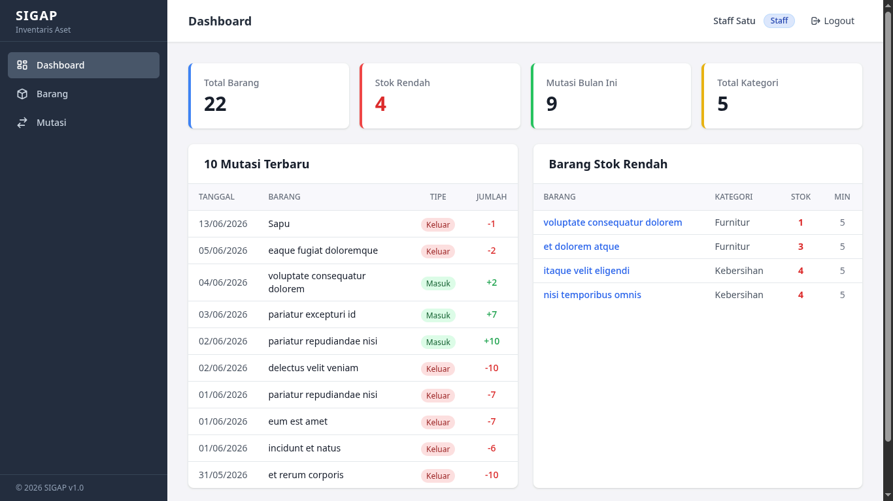

# SIGAP — Sistem Inventaris & Aset Barang

Aplikasi web manajemen inventaris laboratorium yang dibangun di atas Laravel 13 dan Livewire 4. SIGAP memudahkan pencatatan aset, pemantauan stok barang habis pakai, serta riwayat transaksi masuk dan keluar secara digital.

**Mata Kuliah:** Pemrograman Web 2  
**Program Studi:** Informatika — Fakultas Teknik, UNSOED  
**Paket:** 1 — SIGAP (Sistem Inventaris & Aset Barang)

---

## Screenshots

### Halaman Welcome


### Dashboard


---

## Deskripsi Aplikasi

Laboratorium sering menghadapi masalah aset yang berpindah ruang dan stok barang yang tidak terpantau. SIGAP hadir sebagai solusi pencatatan inventaris berbasis web yang memungkinkan petugas mencatat barang masuk/keluar, memantau stok secara realtime, dan mendapatkan peringatan saat stok mendekati batas minimum — semua tanpa perlu reload halaman berulang kali berkat Livewire 4.

---

## Tech Stack

| Teknologi | Versi | Keterangan |
|-----------|-------|------------|
| PHP | 8.3+ | Backend language |
| Laravel | 13.x | PHP Framework |
| Livewire | 4.x (Volt) | Reactive UI tanpa full-page reload |
| Tailwind CSS | 3.x | Utility-first CSS framework |
| Alpine.js | 3.x | Interaksi UI ringan |
| MySQL / MariaDB | 8.0+ / 10.6+ | Database |
| Vite | 5.x | Asset bundler |
| QRCode.js | 1.0.0 | Generate QR Code di sisi client |

---

## Fitur Aplikasi

### Autentikasi dan Hak Akses
Aplikasi menggunakan Laravel Breeze untuk login dan register. Terdapat dua peran pengguna: **Admin** yang memiliki akses penuh ke seluruh fitur termasuk manajemen kategori, lokasi, dan laporan; serta **Staff** yang dapat mencatat mutasi dan memantau data barang.

### Manajemen Barang
Pengelolaan barang mencakup CRUD lengkap dengan upload foto. Setiap barang memiliki kode unik, kategori, lokasi penyimpanan, satuan, stok aktual, dan batas stok minimum. Halaman daftar barang dilengkapi filter realtime berdasarkan nama, kode, kategori, dan lokasi. Status stok ditampilkan sebagai badge berwarna — hijau untuk stok aman, merah untuk stok rendah.

### Manajemen Kategori dan Lokasi
Khusus untuk admin. Kategori dan lokasi dapat ditambah, diubah, dan dihapus. Kategori yang masih memiliki barang terdaftar tidak dapat dihapus untuk menjaga integritas data.

### Mutasi / Transaksi Barang
Setiap pergerakan barang — baik masuk maupun keluar — dicatat sebagai mutasi. Stok barang diperbarui otomatis setelah transaksi tersimpan. Terdapat validasi agar stok tidak bisa menjadi negatif saat transaksi keluar. Riwayat mutasi dapat difilter berdasarkan nama barang, tipe transaksi, dan rentang tanggal.

### Dashboard
Halaman utama menampilkan ringkasan kondisi inventaris: total barang, jumlah barang stok rendah, jumlah mutasi bulan ini, dan total kategori. Di bawahnya tersedia tabel 10 mutasi terbaru dan daftar barang yang stok-nya di bawah batas minimum.

### Laporan
Admin dapat memfilter seluruh data mutasi berdasarkan rentang tanggal, kategori, dan tipe transaksi. Dari halaman laporan, admin dapat langsung mengakses QR Code barang terkait.

### QR Code
Setiap barang memiliki halaman QR Code tersendiri yang menampilkan informasi barang secara ringkas beserta kode QR yang dapat di-scan. Halaman ini dioptimalkan untuk cetak dengan CSS `@media print`.

---

## Implementasi Livewire 4

Berikut fitur-fitur spesifik Livewire 4 yang digunakan dalam aplikasi ini.

| Fitur | Digunakan Di |
|-------|-------------|
| **Volt single-file component** | Semua komponen Livewire dalam satu file `.blade.php` |
| **Island / `#[Lazy]`** | StockSummary, DashboardActivity, ItemMutationHistory, LowStockBadge |
| **`wire:model.live`** | Pencarian dan filter realtime di semua halaman daftar |
| **`wire:poll.60s`** | LowStockBadge di sidebar memperbarui data setiap 60 detik |
| **`wire:confirm`** | Konfirmasi hapus data langsung dari atribut elemen |
| **`wire:loading`** | Indikator loading pada tombol dan tabel saat proses berlangsung |
| **`#[On]` event listener** | StockSummary merespons event `item-saved` dan `mutation-saved` |
| **`WithFileUploads`** | Upload foto barang dengan preview via `temporaryUrl()` |
| **`dispatch()`** | Notifikasi toast antar komponen melalui Alpine.js |

---

## Struktur Komponen Livewire

```
resources/views/livewire/
├── category-manager.blade.php        CRUD Kategori
├── location-manager.blade.php        CRUD Lokasi
├── item-manager.blade.php            CRUD Barang dengan upload foto
├── stock-summary.blade.php           Kartu statistik stok [Lazy]
├── mutation-manager.blade.php        Catat dan lihat riwayat mutasi
├── item-mutation-history.blade.php   Riwayat mutasi per barang [Lazy]
├── dashboard-activity.blade.php      Aktivitas hari ini [Lazy]
├── report-filter.blade.php           Filter laporan mutasi
└── low-stock-badge.blade.php         Badge stok rendah di sidebar [Lazy + poll]
```

---

## Struktur Database

```
users         id, name, email, password, role
categories    id, name, description
locations     id, name, code, description
items         id, category_id, location_id, name, code, unit,
              stock, minimum_stock, photo, description
mutations     id, item_id, user_id, type, quantity, date, note
```

Relasi antar tabel:
- Item belongsTo Category dan Location
- Item hasMany Mutation
- Mutation belongsTo Item dan User
- Category hasMany Item
- Location hasMany Item

---

## Requirements

- PHP >= 8.3 dengan ekstensi `pdo_mysql`, `mysqli`, `gd`, `intl`, `fileinfo`
- Composer >= 2.x
- Node.js >= 18.x dan NPM >= 9.x
- MySQL >= 8.0 atau MariaDB >= 10.6

---

## Instalasi

### 1. Clone repository

```bash
git clone https://github.com/<username>/pemweb2-sigap-<NIM>.git
cd pemweb2-sigap-<NIM>
```

### 2. Install dependencies

```bash
composer install
```

### 3. Salin file environment

```bash
cp .env.example .env
```

### 4. Generate application key

```bash
php artisan key:generate
```

### 5. Konfigurasi database

Edit bagian berikut di file `.env`:

```env
DB_CONNECTION=mysql
DB_HOST=127.0.0.1
DB_PORT=3306
DB_DATABASE=sigap_db
DB_USERNAME=sigap_user
DB_PASSWORD=password123
```

Buat database dan user di MariaDB/MySQL:

```sql
CREATE DATABASE sigap_db CHARACTER SET utf8mb4 COLLATE utf8mb4_unicode_ci;
CREATE USER 'sigap_user'@'localhost' IDENTIFIED BY 'password123';
GRANT ALL PRIVILEGES ON sigap_db.* TO 'sigap_user'@'localhost';
FLUSH PRIVILEGES;
```

### 6. Jalankan migration dan seeder

```bash
php artisan migrate --seed
```

### 7. Buat symbolic link untuk storage

```bash
php artisan storage:link
```

### 8. Install Node dependencies dan build assets

```bash
npm install
npm run build
```

### 9. Jalankan server

```bash
php artisan serve
```

Aplikasi dapat diakses di `http://localhost:8000`.

---

## Akun Default

| Role | Email | Password |
|------|-------|----------|
| Admin | admin@sigap.test | password |
| Staff | staff1@sigap.test | password |
| Staff | staff2@sigap.test | password |

---

## Catatan Teknis

Folder `vendor/` dan `node_modules/` tidak di-commit. Gunakan `.env.example` sebagai template konfigurasi. Foto barang disimpan di `storage/app/public/items/` dan diakses melalui symlink `public/storage` yang dibuat oleh perintah `storage:link`. Stok barang hanya dapat diubah melalui transaksi mutasi, bukan langsung dari form edit barang.

---

## Demo dan Repository

YouTube Demo: [link]  
GitHub Repository: [link]
